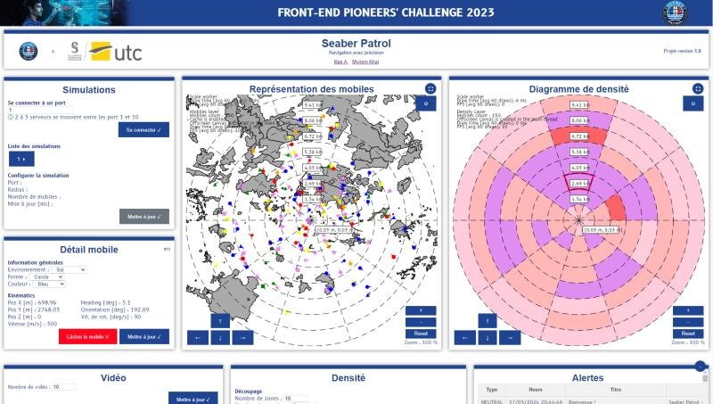
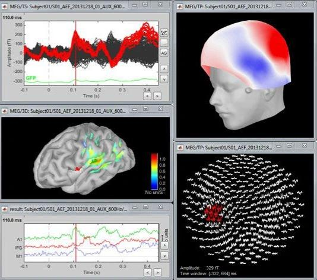
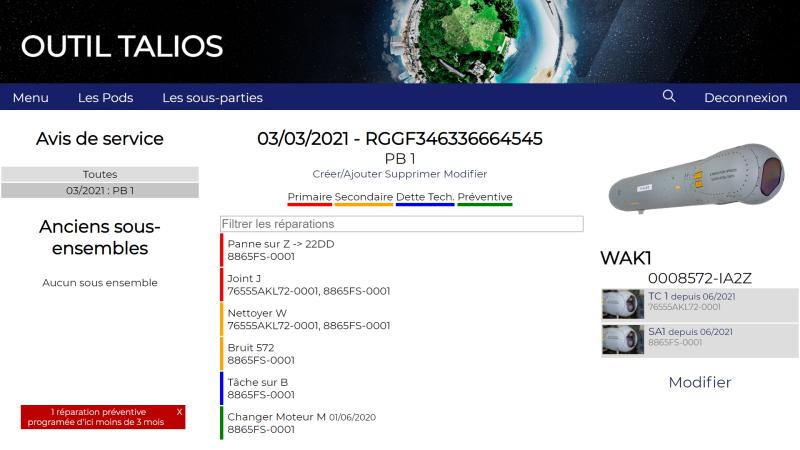
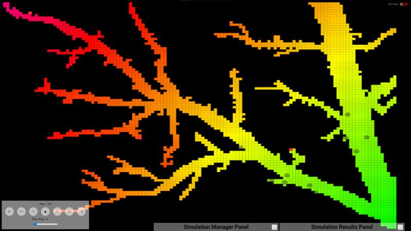

# Hey, I'm Ilian 👋

**Engineer by training. Builder by nature. Curious about everything.**

I'm a French software engineer from [UTC (Sorbonne Universités)](https://www.utc.fr/) who loves jumping between projects, stacks, and ideas. Whether it's designing combat systems for warships, mapping brain activity in a neuroscience lab, building a full-stack SaaS, or automating an entire business — if it's interesting, I'm in.

---

## 🔭 What I'm building now

- 🧠 **[Head of Science](https://HeadOfScience.fr)** — My tutoring company, powered by custom software that automates everything from student acquisition to invoicing. 70+ students, 100% bac success rate over 4 years.
- 💈 **Breem** — A beauty services booking platform, built with Flutter & a custom backend.
- 🤖 Exploring AI-powered automation — LLM integration, MCP servers, intelligent workflows.

---

## 💼 Experience

### 🚢 Naval Group — Software Designer `2021 → 2024 · 3 years`

Software designer on the **Combat Management System** for naval defense.

- Legacy stack: **Java**, UML modeling, **Swing & JavaFX**
- R&D prototyping: **React, Angular**, WebSockets, Web Workers, **WebGL**, mapping engines, hardware video encoding/decoding, **FFmpeg**
- Worked on real-time tactical interfaces for operational warships

 

### 🧬 McGill University — Research Intern `Mar → Jul 2024 · 5 months`

Research assistant at the **Multi FunkIm Lab** in Montreal, working on **BEst** (Brain Entropy in space & time) — a tool for localizing brain activity sources from EEG/MEG data.

- Improved mathematical models for faster & more precise source localization
- Built a **Python wrapper** to make the originally MATLAB-only tool accessible to the Python ecosystem
- Redesigned the GUI for better researcher UX
- Collaborated with researchers across Montreal labs

 

### 🛡️ Thales — Software Designer Intern `Apr → Jul 2021 · 4 months`

Full software lifecycle — from requirements analysis to delivery.

- Designed & built a complete application: **REST API (Python/Flask)**, **PostgreSQL**, **React** frontend
- Wrote test suites, user guides, and project documentation
- Handled planning, architecture, and stakeholder communication

 

---

## 🎓 Education

### 🏫 UTC — Université de Technologie de Compiègne `2021 → 2024`

**Diplôme d'ingénieur** (Master's equivalent) in Computer Science — *Sorbonne Universités*

- Algebra, statistics, operations research, algorithms & data structures
- Networking, cybersecurity, machine learning, databases, OOP
- Member of **JuniorUTC** — delivering real client projects from spec to production

 

---

## 🧰 Tech I work with

  

---

## 📊 GitHub Stats

  
  

---

## 🏗️ Featured projects

| Project | What it does | Stack |
|---------|-------------|-------|
| 🛡️ [**young-domain-guard**](https://github.com/ilianAZZ/young-domain-guard) | Checks domain age to detect phishing & scam sites | JavaScript |
| 🧠 [**best-brainstorm**](https://github.com/ilianAZZ/best-brainstorm) | Brain entropy analysis — localizing brain activity from EEG/MEG | MATLAB |
| 📊 [**scalakmeans**](https://github.com/ilianAZZ/scalakmeans) | K-means clustering from scratch | Scala |
| 🏴‍☠️ [**arcadia**](https://github.com/Arcadia-Solutions/arcadia) | Content-agnostic torrent site & tracker framework | Rust ⭐ 319 |

---

  

<i>I don't specialize — I explore. 🚀</i>

